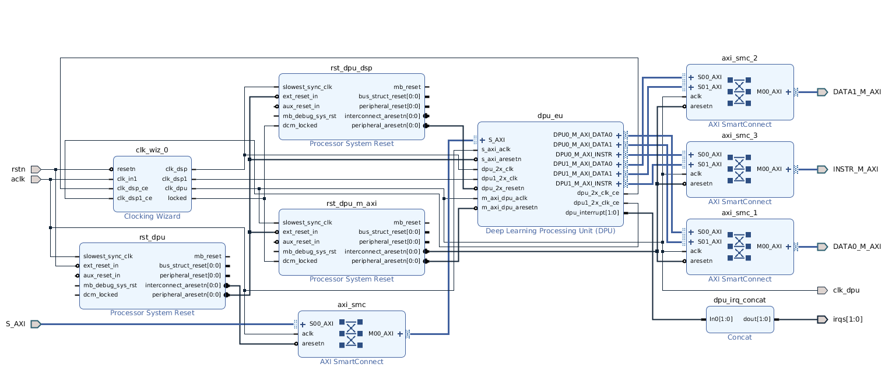
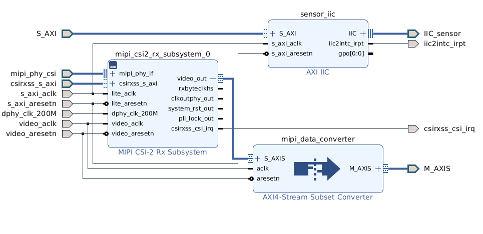
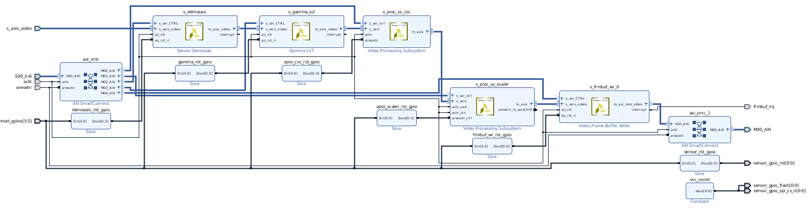

# DPUSYS HW

Author: Wentao Yu \<yu.wenta@husky.neu.edu\>

This is the repository for the ZCU102 hardware part of our EECE7368 2019 Fall project. We use the Xilinx DPU IP with a video pipeline and the PS to do an Deep learning application. The video pipline is used to capture data from a LI-IMX274MIPI-FMC board. the DPU IP is running at 325 MHz in our system. The PS part of this system runs our Deep Learning application on a customized Petalinux based embedded Linux, which are in serpated repositories.

Currently, this repo only contains srcipts and other files which are used to create a project with a DPU configuration: B4096, 2 core (details can be found in the project directory after generating it). Additional scripts to generate the system HW project with different DPU configuration may be added when need. If more than one project generation scripts exists, the only difference between then is the configuration of the DPU IP when we do not specify the difference.

**Note**: Due to the difficulty of version control a Vivado project, this repo only contains the scripts and necessary file (xdc, verilog etc.) for generating our Vivado project(s). Please see the above section for generating the project and bitstream.

## Prerequisite

- Xilinx Vivado 2019.1
- Xilinx MIPI CSI2 RX Subsystem IP License (full or evaluation).
- Xilinx DPU v3.0 IP License (full or evaluation).
- ZCU102 rev 1.0 board.
- LI-IMX274MIPI-FMC board.

**Note**: This project is built on a Ubuntu 18.04 LTS machine using Vivado 2019.1. You may need to adjust it for other build enviroments.

## Create the project

Take our dpusys_2core_B4906 project as an example. Make sure the Vivado tools are in you `$PATH`. Then, use following command:

```shell
# at the root dir of the cloned repo
vivado -mode batch -source scripts/dpusys_2core.tcl -quiet -notrace
```

After the above command finishes, you will find a new directory name `dpusys_2core_B4906` in the `build` folder. This directory contains the new project. To open the project, change the current directory to `build/dpusys_2core_B4906`. Then, use command `vivado dpusys_2core_B4906.xpr &`. You may also use the Vivado GUI to open the new project.

Available different DPU configuration projects:
- 1 core, B1024
- 1 core, B1152
- 1 core, B2304
- 1 core, B4096
- 2 core, B1024
- 2 core, B1152
- 2 core, B2304
- 2 core, B4096

Here are the screenshots of what the created project's board design shoule look like:


Here is the details of `dpu_ss` in the above db:



Here is the details of the subsystem that capture the LI-IMX274MIPI-FMC board's output:



Here is the details of the video pipeline subsystem that processes the MIPI camera output:



## Generate the bitstream
Open the project with Vivado GUI.

1. Click Generate Bitstream.
1. Accept the defaults.

**Note**: This step take at least 45 minutes, depending on the machine. In our machine, AMD 3700X + 32GB DDR4 RAM, it takes at least 1 hour.

**Warning**: Vivado may crash when implementing this project. It is caused by Vivado itself with an abnormal termination error. We have no idea about how to solve it currently. All you need to do is reboot and hope Vivado work well in the next run.

## Export hardware
When the bitstream generation process is complete, do the following steps to export the *.hdf for use by PetaLinux:

1. Click File > Export > Export Hardware.
1. Make sure to include the bitstream.
1. Export the hardware platform to where you want to create the Petalinux project.
1. Click OK.

## Use prebuilt HSI

This repo contains prebuilt HSI for ZCU102. These HSI can be used as hw description for building Petalinux project with command:
```bash
petalinux-config --get-hw-description path/to/hsi/
```

### Use Makefile to build the project

This repo contains experimental Makefile for automatically building projects, implementing projects and generating bitstream. To build all projects:

```bash
make all
```

A build folder will be create if no exists. Then, all vivado project will be built. Then folder name for each project obey following pattern: dpusys_\<n\>core_\<arch_name\>, where n = 1|2, arch_name = B1024|B1152|B2304|B3096.

To implement a project:

```bash
# make the project if no prev one
# make make dpusys_<n>core_<arch_name>
make dpusys_<n>core_<arch_name>.impl
```

Then, to create a bitstream for a project:

```bash
make dpusys_<n>core_<arch_name>.bit
```

**Note: You must do `make dpu_<n>core_<arch_name>.impl` before generating a bitstream. Implementation for a project may failed due to Vivado internal abnormal termination. In this case, you may just need to rerun the implementation step.**

## License

All file except the files **dpu_ip** directory, is using the MIT license.


## Disclaimer

**WARNING:`dpu_ip` only contains the Xilinx DPU Evaluation IP, which is provided by the Xilinx ZCU102 DPU TRD (https://www.xilinx.com/products/design-tools/ai-inference/ai-developer-hub.html#edge). You must make sure to obtain a proper license when using in a production project. With the evaluation license, this IP will down after 1 hours, depending on the DPU AXI BUS frequence.**